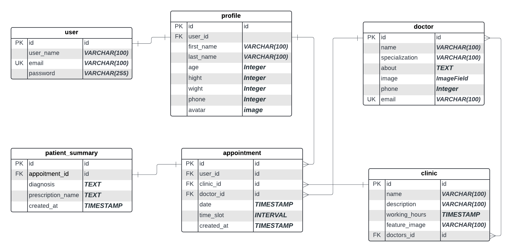

# LAB-Django-AUTH

### Project Overview: Hospital Website

In this project you are going to build a web application for a hospital. The website will allow users to view clinic details, see information about doctors, make reservations, and manage their reservations.

### UML Design

### Requirements

1. **User Registration and Authentication**:

   - Users must be able to sign up and log in to the system.
   - Only authenticated users can make reservations and view their reservation history.

2. **Clinic Management**:

   - Users can view a list of clinics.
   - Users can view detailed information about each clinic, including its working hours and the doctors assigned to it.

3. **Doctor Management**:

   - Users can view a list of doctors.
   - Users can view detailed information about each doctor, including their specialization and the clinic(s) they are associated with.

4. **Reservation System**:
   - Authenticated users can make a reservation at a clinic.
   - Users can choose a specific doctor when making a reservation.
   - Users can view, or cancel their reservations.

#### Models and Their Relationships

1. **User (Django's default User model)**

   - Extended with a `Profile` model with additional fields (like phone number, address) are required.

2. **Profile**

   - **Fields**:
     - `user` (OneToOneField to User)
     - `phone_number` (CharField)
     - `address` (TextField)
   - **Relationships**:
     - One-to-One with `User`.

3. **Doctor**

   - **Fields**:
     - `full_name` (CharField)
     - `specialization` (CharField with appropriate choices)
     - `bio` (TextField)
     - `photo` (ImageField)

4. **Clinic**

   - **Fields**:
     - `name` (CharField)
     - `description` (TextField)
     - `working_hours` (You can make it a charfield with choices consisting of times slots available)
     - `feature_image` (ImageField)
     - `doctors` (Many-to-Many with `Doctor`)
   - **Relationships**:
     - Many-to-Many with `Doctor`.

5. **Reservation**

   - **Fields**:

     - `user` (ForeignKey to User)
     - `clinic` (ForeignKey to Clinic)
     - `doctor` (ForeignKey to Doctor)
     - `date` (DateField)
     - `time_slot` (TimeField)
     - `created_at` (DateTimeField, auto_now_add=True)

   - **Relationships**:
     - Many-to-One with `User`.
     - Many-to-One with `Clinic`.
     - Many-to-One with `Doctor`.

### Key Features to Implement

1. **Required Pages**

   - Home page: In home page user can view informatino about the hospital , view clinics (limited with view more) , doctors (limited with view more) in the hospital, etc.
   - Clinics Page: view all clinics with pagination.
   - Doctors page: View all doctors with pagination.
   - Clinic Detail page: view clinic details, doctors working in that clinic, working hours, and the form for making a reservation for registered users.
   - Doctor Detail Page: View doctor details.
   - User Profile page: (private), where he/she can view or update his/her info.
   - User reservations page: (private) , where he/she can view or cancel reservations.

2. **Registration and Login**:

   - Use Django's built-in authentication system.
   - Extend the `User` model if necessary using a `Profile` model.

3. **Clinic Listing and Details**:

   - A page to list all clinics.
   - A detail page for each clinic showing its information and assigned doctors.

4. **Doctor Listing and Details**:

   - A page to list all doctors.
   - A detail page for each doctor showing their information and associated clinics.

5. **Reservation System**:

   - A form for authenticated users to make a reservation by choosing a clinic, doctor, and date time slot.

6. **User Dashboard**:

   - A profile page where users can view and update their information.
   - A reservations page where users can manage their bookings.

7. **Staff Dashboard**:

- implement update, add, delete for clinics, doctors. (only staff can access this page and use the features in it.

### Bonus

- Implement a search feature for clinics and doctors.
- When making a reservation on a clinic, check first that there is no prior reservation by another patient on the same clinic and same doctor.
- Add email notifications for reservation confirmations or reminders.
